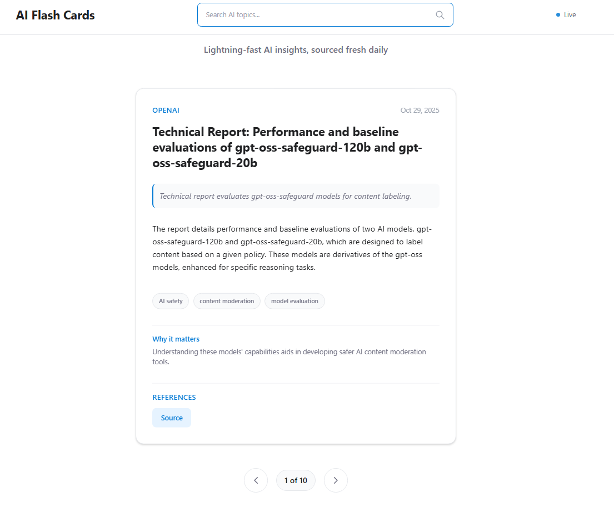

# AI Flash Cards

**Lightning-fast AI insights, sourced fresh daily.**

🌐 **[Live Demo](https://ai-flash-cards-master-6b09b9b.kuberns.cloud/)** - Try it now!

## 🎯 The Problem

The AI landscape is overwhelming. With hundreds of blogs, research papers, and news sources covering AI breakthroughs, it's nearly impossible to stay updated and identify what truly matters. Information overload makes it difficult to:

- **Stay ahead** of the latest AI developments
- **Filter signal from noise** in the vast AI content landscape  
- **Find relevant information** on specific AI topics quickly
- **Consume content efficiently** without spending hours reading

## 💡 The Solution

AI Flash Cards Service delivers latest news on AI breakthroughs & releases as swipeable cards. 

## 🔄 How It Works




### Daily Flow
1. **🌅 6 AM UTC**: Automated ingestion fetches and saves raw articles
2. **🔄 Every 2 Hours**: Relevance check job processes all unchecked articles (new + backlog)
3. **🔄 Every 3 Hours**: Summarization job processes all relevant unsummarized articles (up to 20 per run)
4. **📱 User Experience**: Fresh cards ready for consumption (with smart fallbacks)
5. **🔍 Search**: On-demand topic exploration anytime


It utilizes RSS feeds from trusted sources like Hugging Face, OpenAI, Hacker News, DeepMind, Microsoft, NVIDIA, AWS, arXiv, MIT.edu - fetches latest blogs, applies LLM powered filtering to figure out relevance and serves you the top 10 most relevant articles every day. Also provides search functionality to provide latest on any AI-related topic - this is done with help of semantic search on precomputed vectors on sources.

## Quick Start

### Prerequisites for development
- Python 3.11+
- Azure OpenAI service
- Azure AI Search service

### Local Development

1. **Clone and setup**:
   ```bash
   git clone <repo>
   cd AI-Flash-Cards
   python -m venv venv
   source venv/bin/activate  # Windows: venv\Scripts\activate
   pip install -r requirements.txt
   ```

2. **Configure environment**:
   ```bash
   cp env.example .env
   # Edit .env with your Azure credentials
   ```

3. **Run the application**:
   ```bash
   uvicorn backend.main:app --reload --host 0.0.0.0 --port 8000
   ```

4. **Access the app**:
   - Frontend: http://localhost:8000
   - API docs: http://localhost:8000/docs

### Azure Deployment

1. **Create Azure resources**:
   - Azure OpenAI service
   - Azure AI Search service
   - Azure Web App

2. **Configure Azure Web App**:
   - Set environment variables in App Settings
   - Mount Azure Files share to `/data` path
   - Deploy code via GitHub Actions or Azure CLI

3. **Initialize database**:
   ```bash
   # Run once to create tables and index
   python -m backend.database init
   ```

## Architecture

- **Backend**: FastAPI with SQLite + Azure AI Search
- **Frontend**: Vanilla JS + Tailwind CSS
- **AI**: Azure OpenAI for summarization and embeddings
- **Storage**: Azure Files for persistent SQLite database

## 🚀 Version 1 Improvements

### Decoupled Processing Pipeline
- **Two-Phase Ingestion**: Raw articles are saved to SQLite first, then AI processing happens in separate scheduled jobs
- **Resilience**: Content is preserved even if AI processing fails
- **Independent Jobs**: Relevance checking and summarization run on separate schedules (every 2-3 hours)
- **Prioritized Processing**: Most recently published articles are processed first for faster availability
- **Smart Database Reset**: Database cleared daily only if article fetch succeeds (prevents data loss on failures)

### Quality-Based Relevance Scoring
- **LLM Scoring System**: Articles scored 0.0-1.0 based on value and quality using few-shot examples
- **Intelligent Content Filtering**: Only articles with score ≥ 0.7 pass (filters out low-value content like casual comments, personal blogs, insufficient content, irrelavant content, etc)
- **Score-Based Ordering**: Articles ordered by relevance score for morning brief and summarization prioritization

### Smart Status Tracking
- **Processing Flags**: Articles track `is_relevance_check_done`, `is_summarized`, and `relevance_score`
- **Failure Handling**: `failure_count` prevents infinite retries (stops after 3 failures)
- **Quality Assurance**: Fully processed articles prioritized, with smart fallbacks for incomplete processing

### Graceful Fallback Logic
- **Smart Querying**: If fully processed articles aren't available, system gracefully falls back to:
  1. Relevance-checked articles (best quality)
  2. Raw articles with quality filters (minimum title length, content substance, source filtering)
- **Quality Filters in Last Resort**: Ensures even unprocessed articles meet minimum quality standards
- **No Empty Results**: Users always see relevant content even during processing delays or AI service failures
- **Improved Morning Brief**: Smart fallback fills the morning brief to full limit even when fewer recent articles are available

### Scheduled Job Architecture
- **Daily Ingestion** (6 AM UTC): Fetches and saves raw articles (clears DB only if fetch succeeds)
- **Relevance Check Job** (Every 2 hours): Processes unchecked articles prioritized by publish date (score ≥ 0.7 threshold)
- **Summarization Job** (Every 3 hours): Summarizes relevant articles prioritized by relevance score (up to 20 per run)

### Enhanced Data Quality
- **URL Validation**: Invalid placeholder URLs filtered from references
- **Smart URL Matching**: Handles URL variations (trailing slashes, www, etc.) to prevent duplicates
- **Source Guarantee**: Always includes at least the source article URL in references
- **Improved Prompts**: Better LLM instructions ensure only real URLs from content are extracted

### Vector Search Performance & Reliability
- **Fast Timeout with Fallback**: Vector search has 2.5-second timeout with automatic fallback to database search (ensures users never wait)
- **Complete Field Storage**: Vector store now includes all fields (tl_dr, why_it_matters, references, tags) for full searchability
- **Smart Schema Migration**: Automatic detection of missing index fields with option to recreate index
- **Re-indexing Tools**: Easy re-sync of vector store with database using built-in scripts and API endpoints
- **Stale Document Cleanup**: Automatic cleanup of documents that no longer exist in database after processing completes

### Enhanced User Experience
- **Search Loading Indicator**: Visual loader with spinning animation shows "Searching AI topics..." during search operations
- **Quick Navigation**: Cross (X) button in topic header provides quick return to morning brief after search
- **Dynamic Topic Summaries**: AI-generated topic summaries synthesize search results into concise overviews on-the-fly

### Benefits
- ✅ **Faster Ingestion**: Raw articles saved immediately
- ✅ **Better Recovery**: Can retry AI processing without re-fetching
- ✅ **Improved Reliability**: Failure tracking prevents resource waste
- ✅ **Higher Quality Content**: Relevance scoring and quality filters ensure valuable articles only
- ✅ **Better UX**: Smart fallbacks ensure users always see relevant content
- ✅ **Faster Fresh Content**: Most recent, highest-scoring articles processed first
- ✅ **Responsive Search**: Vector search timeout ensures instant results (never hangs)
- ✅ **Complete Search Results**: All card fields (tl_dr, why_it_matters, tags, references) available in search results
- ✅ **Maintainable Vector Store**: Easy re-indexing and schema management tools
- ✅ **Better UX Feedback**: Loading indicators and smooth transitions improve perceived performance
- ✅ **Intuitive Navigation**: Easy return to morning brief from search results

## API Endpoints

- `GET /api/morning-brief` - Daily top 10 most relevant AI articles as swipeable cards
- `GET /api/topic-feed?q={query}` - Semantic search for AI insights on any topic
- `GET /api/health` - System health check
- `GET /api/dev/stats` - Development statistics (dev only)
- `POST /api/dev/reindex-vector-store` - Re-index all summarized articles to vector store (dev only)

## Development

### Project Structure
```
AI-Flash-Cards/
├── backend/           # FastAPI application
├── frontend/         # Static web files (HTML/CSS/JS)
├── test/             # Test suite
│   ├── unit/         # Unit tests
│   ├── integration/  # Integration tests
│   └── scripts/      # Utility scripts
├── data/            # SQLite database storage
├── INSTRUCTIONS/    # Implementation guides
└── requirements.txt  # Python dependencies
```

### Testing

Run the complete test suite:
```bash
python test/run_tests.py
```

Run specific test categories:
```bash
# Unit tests only
python test/run_unit_tests.py

# Integration tests only  
python test/run_integration_tests.py

# Utility scripts
python test/scripts/run_ingestion.py
```

### Key Features
- **Daily Morning Brief**: Top 10 most relevant AI articles delivered as swipeable cards
- **Smart AI Filtering**: Automatically filters hundreds of AI sources to find relevance
- **Semantic Search**: Find relevant articles on any AI topic using vector search
- **AI-Powered Summaries**: Each card includes TL;DR, summary, and "why it matters"
- **Trusted Sources**: Content from Hugging Face, OpenAI, Hacker News, DeepMind, Microsoft, NVIDIA, AWS, arXiv, MIT.edu